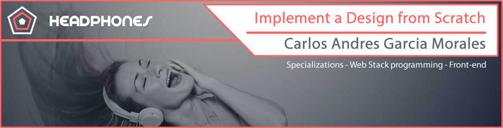
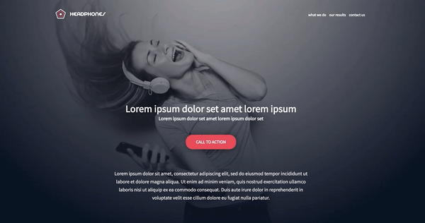
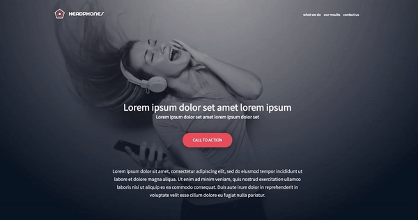

## :orange_book: Expected to Look at this Concept

In this project, you will implement from scratch, without any library, a web page. You will use all HTML/CSS/Accessibility/Responsive design knowledges that you learned previously.

You won�t have a lot of instruction, you are free to implement it the way that you want - the objective is simple: Have a fully functional web page that looks the same as the designer file.

Here the final result:


This webpage has been designed by Nicolas Philippot, UI/UX designer.

## Requirements

- you are not allowed to import external CSS framework (like Bootstrap)
- you are not to use Javascript

## :books: Tasks

**0. Read and be familiar with Figma**

Create an account in Figma and open this project and �Duplicate to your Drafts� to have access to all design details.

If you can�t access to it, please find here the [Figma file](https://www.figma.com/file/gkWRcFqkwtruWZgSfnnHF0/Holberton-School---Headphone-company?node-id=0%3A2)


Important notes with Figma:

- if your computer doesn�t have missing fonts, you can find them here: [source-sans-pro](https://www.fontsquirrel.com/fonts/source-sans-pro) and [Spin-Cycle-OT](https://www.fontsquirrel.com/fonts/Spin-Cycle-OT)
- some values are in float - feel free to round them

For this task, please write an amazing README.md

### Interactions note:

- the web page must switch to the mobile version when the screen width is 480px or less
- links hover/active: #FF6565
- button hover/active: opacity: 0.9
- max width of the content: 1000px centered in the page


**1. Header**

Files: [0-index.html](Tasks/0-index.html/) - [0-styles.css](Tasks/0-styles.css/)

Building a web page the right way, is not easy - expect if you put in place strong foundations:

- reset CSS styling
- use variables
- simple/�as generic as you can� CSS selectors
- avoid as more as you can super specific CSS selector
- simple HTML structure - div containers are your friend!

Last advice: I always start to build a web page from outside to inside and from top to bottom.

Now, your turn!

For this first task: create the header/hero piece

Here an archive of all assets needed: [images_0x09.zip](https://intranet.hbtn.io/rltoken/6AnXuu5fO78UpPRvkBX3cw)

### Desktop




### Mobile


**2. "What we do..." section**

Files: [1-index.html](Tasks/1-index.html/) - [1-styles.css](Tasks/1-styles.css/)

Copy files from the previous task.

For this second task: create the �What we do�� section

In this section, you will need custom font icons. Here the archive of it: [holberton_school-icon.zip](https://intranet.hbtn.io/rltoken/UTLmru8XUpDXW2EbLdLyew) Inside you will find demo page of how to use it.

Important: try to build as generic as you can� you will probably need some components in next section.


**3. "Our results" section**

Files: [2-index.html](Tasks/2-index.html/) - [2-styles.css](Tasks/2-styles.css/)

Copy files from the previous task.

For this third task: create the �Our results� section

Now you can reuse components form the previous task!


**4. Contact us**

Files: [3-index.html](Tasks/3-index.html/) - [3-styles.css](Tasks/3-styles.css/)

Copy files from the previous task.

A good landing page has always a contact form.

You are free to add any animations and/or constraints on fields.


**5. Footer**

Files: [4-index.html](Tasks/4-index.html/) - [4-styles.css](Tasks/4-styles.css/)

Copy files from the previous task.

Last piece of the page� the Footer!

When you are done, here the result:

### Desktop:



### Mobile:


And you are done!

Good job!


**6. Replace image by... code!**

Files: [100-index.html](Tasks/100-index.html/) - [100-styles.css](Tasks/100-styles.css/)

In the section �Our results�, replace item background image by HTML and CSS only!�


**7. Let's animate items**

Files: [101-index.html](Tasks/101-index.html/) - [101-styles.css](Tasks/101-styles.css/)

From 4-index.html and 4-styles.css, add fun animations to �What we do�� and �Our results� sections items row. Either all the time, either when hover.

Scaling, opacity, rotation, bouncing� many options!


**8. And SASS??**

Files: [102-styles.css](Tasks/102-styles.css/)

Take your 101-styles.css file and create a 102-styles.scss that will be the SASS version of it.

```sh
$ sass 102-styles.scss > 101-styles.css
```


## :sagittarius: Author

> :man: Carlos Andres Garcia Morales

> :e-mail: [E-mail](agzsoftsi@gmail.com)

> :octocat: [Github](https://github.com/agzsoftsi)

> :bird: [Twiiter](https://twitter.com/karlgarmor)

> :blue_book: [Linkedin](https://twitter.com/karlgarmor)

> :globe_with_meridians: [WebPage](https://www.agzsoftsi.tech/)
